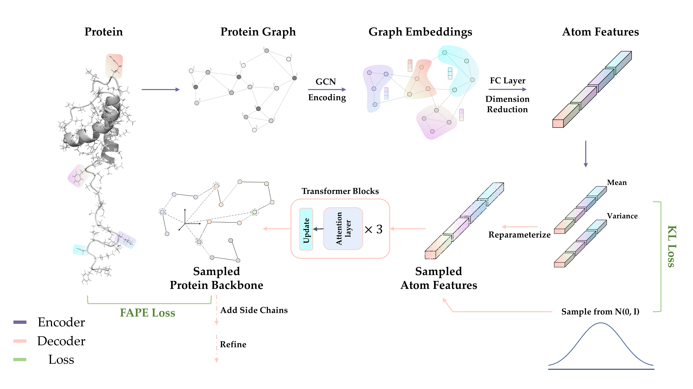

# Phanto-IDP: A model for precise and fast IDP backbone generation



Phanto-IDP is a VAE-based generative deep learning model, which aims to **precisely reconstruct** IDP conformation ensembles  and **generate** unseen structures **at a rather high speed**. This is a raw version of Phanto-IDP uploaded for further tests.


## Usage

### Environment Setup

The following packages are required in this work.

* numpy==1.19.5 
* ConfigArgParse==1.2 
* joblib==0.14.1 
* torch==1.8.0
* einops==0.4.1

You may need the following two packages for analysis and plotting.

* matplotlib==3.3.4
* biotite==0.37.0

### Preprocess

Before running the model, you have to first compile the [mylddt](https://github.com/gjoni/mylddt) toolset.

```shell
cd ./preprocess
make all
```

### User-defined training process

For training model on your own trajectories, you have to first process the target trajectory into corresponding graph representation ensembles. This process is done with mylddt toolset, which accept one conformation at a time.

```shell
./traj_process.sh
python pdb_parse.py
```

You may have to check the path information in both fils to ensure that the scripts do extract trajectory features.

Then you can train the model with preset arguments in `arguments.py`, or adjust the parameters in command line as followed:

```shell
python main.py trial_run --epochs 400 --batch_size 32  
# the command line arguments should always start with your task name
```

One epoch on approximate 38,000 conformations may take ~130 seconds, and 400 epochs is absolutely enough for model convergence.

### Generation with pre-trained model

We provide three checkpoint files for RS1, PaaA2, α-synuclein seperately. You can use the three pre-trained models for direct IDP conformation generation.

```shell
python generate.py generate_trial --temp 0.1
```

By now, our model reaches a rather satisfying with real conformations as seeds for generation, but unconditional generation is still quite hard.
